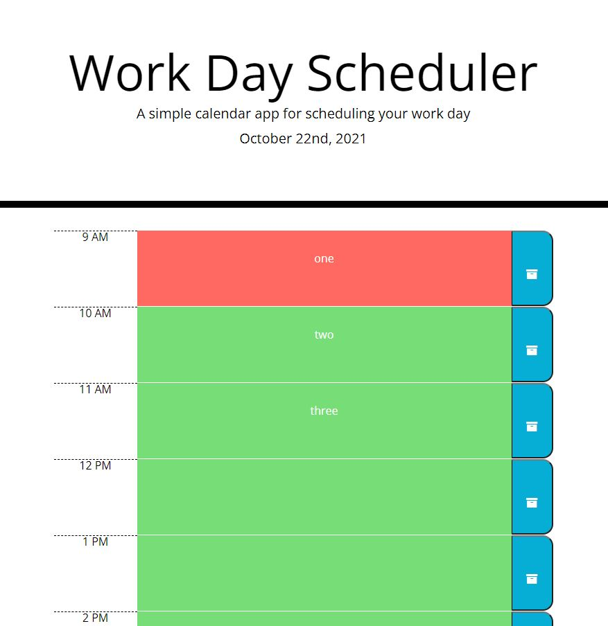

## ESMT Coding Boot Camp

## Homework-05

# Work Day Scheduler

# Description

This is a simple day planner using moment.js to track the days progression. Business hour blocks are color coded based on whether the block is in the past, present or future at screen load. Users can enter tasks by clicking a block and entering text. When they click the associated save button, the task is saved to local storage. On a refresh, saved tasks are retrieved from local storage and the colors of blocks are updated (if sufficient time has elapsed since last screen load).

# Link to deployed app

https://queenmcsteve.github.io/Homework-05/

# Link to repository

https://github.com/queenmcsteve/Homework-05

# Screenshot

App between 9-10AM, with three dummy tasks in local storage

